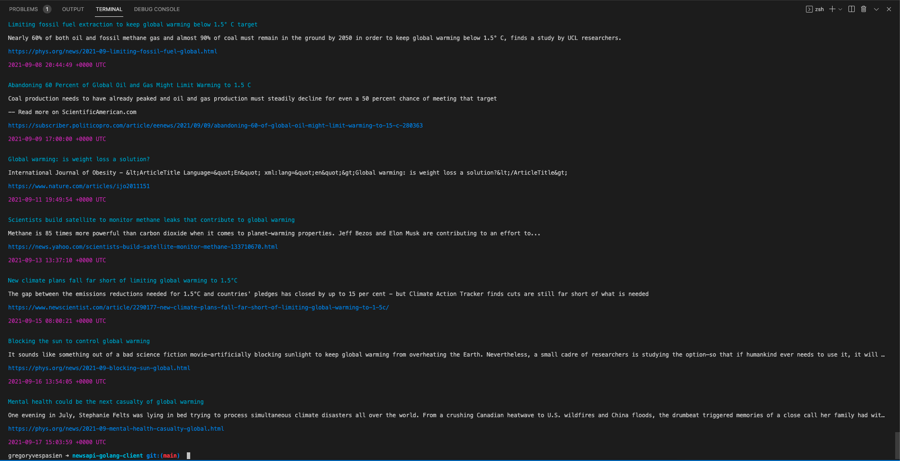

# Newsapi Golang client

# Newsapi CLI

A single command program to fetch articles through the [News API](https://newsapi.org/)

Requirements:
* a News API [key](https://newsapi.org/register) whose value should be exported as `NEWS_API_KEY` in your `~/.bashrc` or `~/.zshrc`
* Go >= 1.17

## Build the app

```sh
chmod +x build-and-install.sh
./build-and-install.sh
```

## Get articles

```sh
# Get 10 articles whose title contains 'flooding' and published in cnn.com or bb.com
news -t "flooding" -l en -m 10 -d cnn.com,bbc.com

# Get articles whose body or title contains 'degrowth' and published in the ny times
news -q "degrowth" -d nytimes.com
```

